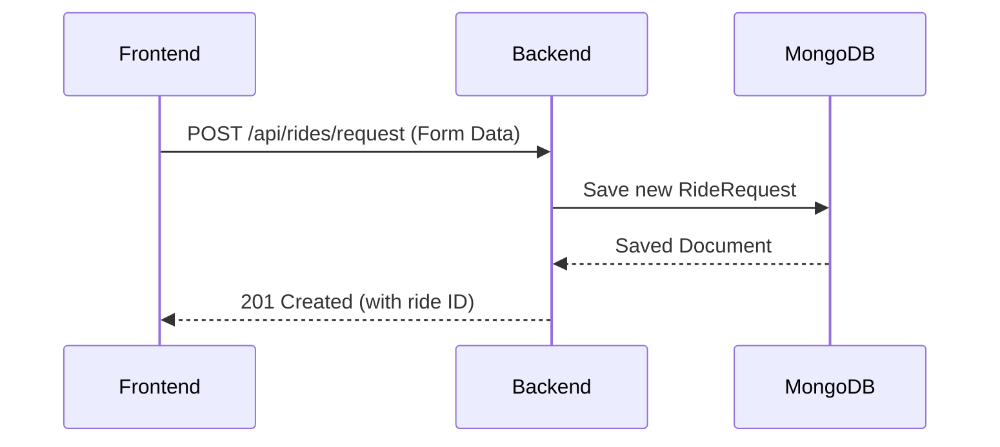

## Data Flow Diagram

```mermaid
sequenceDiagram
    participant Frontend
    participant Backend
    participant MongoDB

    Frontend->>Backend: POST /api/rides/request (Form Data)
    Backend->>MongoDB: Save new RideRequest
    MongoDB-->>Backend: Saved Document
    Backend-->>Frontend: 201 Created (with ride ID)
```